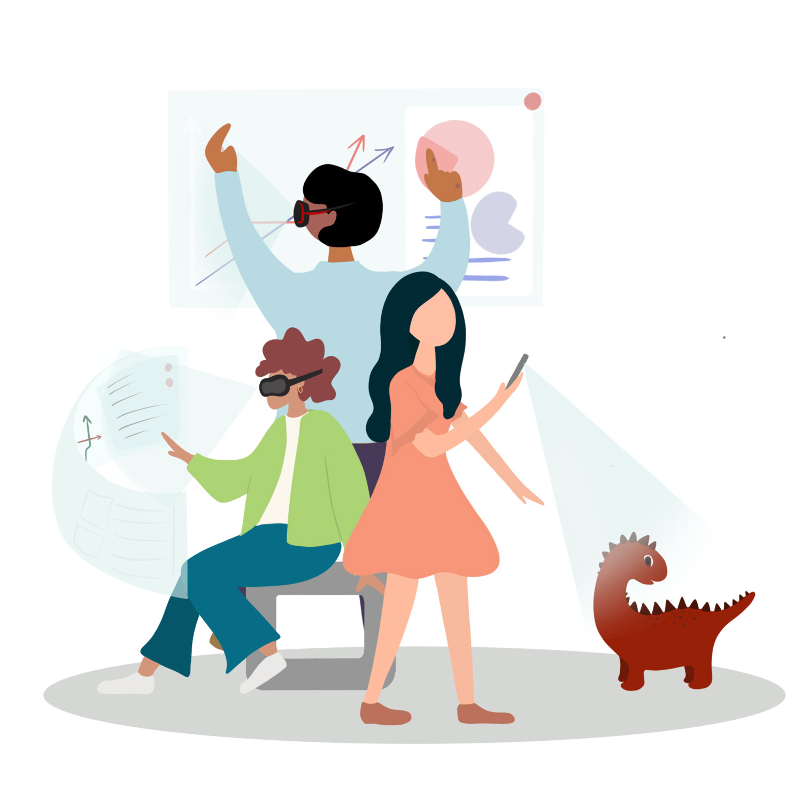

# ARchitecture Repository :id=start

?> Just in a few months ago, we didn't expect to be here. So we are going to make the FUTURE how we can't imagine NOW!

Here is all for you, and it's GROWING with you, and LEARNS from you.

## Start With <mark>Quick Access</mark> or Use Sidebar. :id=quick-access

- [Augmented Reality](xr/ar/)
- [Unity for AR](xr/ar/services/unity)
- [Vuforia for AR](xr/ar/services/vuforia)

  
Have a GOOD day! :wink:

